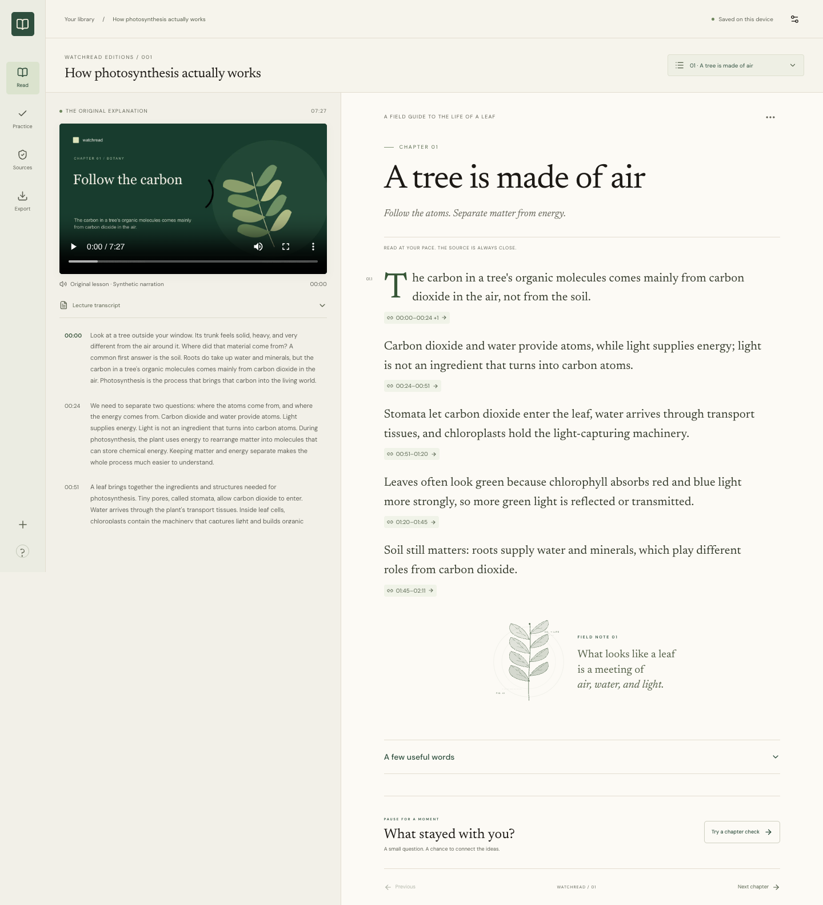

# WatchRead

A lecture you can read. An explanation you can return to.

WatchRead turns a lecture transcript into a study companion. Read a chapter, check where an explanation came from, and try a question. If you choose a wrong answer, the feedback leads you back to the relevant source passage and a different question about the same idea.

Fable 5.1 composed and reviewed the prepared companions. Its work includes the chapters, explanations, glossary, practice questions, and misconception feedback. The [credits](CREDITS.md) link to the recorded model runs and source material.

[Try WatchRead](https://watchread.vercel.app) · [Take the tour](https://watchread.vercel.app/guide) · [Presentation script](PRESENTATION.md)



## Try it in two minutes

1. Open the photosynthesis sample and click a source time below an explanation. The video jumps to the matching passage.
2. Open Practice in chapter one. Choose "Minerals absorbed from the soil" and read the feedback.
3. Click "Revisit the explanation", then "Try a different question". Choose "Carbon atoms taken in as carbon dioxide".
4. Wait for "Saved on this device", then refresh. The attempt remains in your recovery trail.
5. Open Export to download the reading copy or a project you can restore later.

The library also includes a text-only lesson about why a metal spoon feels colder than a wooden one. It uses transcript references without inventing video timestamps.

## What is live

The public site includes both prepared lessons, source playback, practice, browser-local saving, outline edits, and exports. You can also save new source files as a draft or restore a project created elsewhere.

Fresh AI composition currently runs in the local laptop version. It is not enabled on the public Vercel deployment. Export the local result as Project JSON and restore it on the public site to move a companion between them. See [deployment details](DEPLOYMENT.md).

## Run locally

```sh
git clone https://github.com/amanmaqsood/watchread.git
cd watchread
npm ci
npm run build
npm start
```

Open http://127.0.0.1:3000. Keep the server running. For development, use `npm run dev`.

The build was tested with Node 24.16.0, npm, and Google Chrome. Next.js 16 requires Node 20.9 or later. Both prepared companions work without a model credential. Fonts and the sample recording are bundled.

## Generate a new companion with Fable 5.1

Use an authenticated Claude CLI installation with access to Fable 5.1. Copy `.env.example` to `.env.local`, then set:

```dotenv
WATCHREAD_CLAUDE_CLI=1
WATCHREAD_CLAUDE_MODEL=claude-fable-5-1
```

Restart WatchRead after changing these settings. The server must be able to find `claude` on its PATH. The app does not sign you in or give the model access to tools.

Open New companion, add a VTT, SRT, or TXT transcript, and optionally add its original recording. Composition sends the transcript to the remote model and needs an internet connection. The video stays on your device. A failed or cancelled request keeps your imported source and previous companion.

A direct Anthropic SDK adapter is also implemented. Set both `ANTHROPIC_API_KEY` and an available `ANTHROPIC_MODEL` to select it. That path has not been verified here with live API credentials. Keep credentials in server-only settings, never in a `NEXT_PUBLIC_` variable. See the [runtime decision](docs/adr/0004-local-model-runtime.md).

## Files, saving, and exports

| Input or output | Supported behavior |
| --- | --- |
| MP4 or WebM | Up to 30 minutes and 150 MB. H.264/AAC MP4 is the tested format. |
| VTT, SRT, or TXT | Up to 1 MB and 1,200 cues. TXT works without timestamps. |
| Model input | The serialized transcript is limited to 48,000 bytes. Token usage is checked separately. |
| Video without a transcript | Saves as a draft. Automatic transcription and YouTube scraping are not included. |
| Export | Markdown, standalone HTML, a citation CSV, or Project JSON. |
| Restore | JSON restores the transcript, chapters, attempts, revisions, and model record. Reconnect the original video separately; its SHA-256 must match. |

Projects and video files are stored in this browser's IndexedDB. They do not sync across devices or between localhost and the public site. Export a backup before clearing browser data. If the video is missing, you can still read the source text and reconnect the file. Prepared lessons remain readable when browser storage is unavailable, but edits must be exported to keep them.

## How source checking works

Each generated claim refers to transcript cues and a hashed source revision. Code checks IDs, answer structure, timing, and quoted text. A separate model pass reviews whether the source supports the material. Generation can attempt a bounded repair; unresolved content is marked for review and dependent practice questions are withheld.

Replacing the transcript marks old explanations and checks for review. You can restore the previous source and companion or generate a new version. Attempts belong to the source revision and model run used when answering.

Source support does not guarantee factual correctness. The source can be wrong, and model review can miss an error. A correct follow-up answer also does not prove lasting learning. The [evaluation report](evals/REPORT.md) records the small test corpus, completed runs, and failures. No human learner study has been conducted.

## About the sample

The photosynthesis recording is an original 7 minute 27 second slide lesson with macOS Samantha synthetic narration. It is not a recorded human lecturer. Fable 5.1 generated and reviewed its companion; the prepared edition has a few disclosed editorial changes. The [provenance record](content/sample/provenance.json) lists hashes, references, the generation ID, and those changes.

## Checks

```sh
npm run lint
npm run typecheck
npm test
npm run build
# With the local server running and Google Chrome installed:
npm run test:e2e
# These opt-in commands make real model calls:
WATCHREAD_LIVE_TEST=1 npx playwright test tests/browser/live.spec.ts
npm run eval
npx tsx scripts/evaluate-adversarial.ts
```

The build includes a copy check for first-party interface text and current public documentation. Original transcripts, saved model outputs, code samples, and historical evidence are preserved rather than rewritten by that check.

Browser tests use the installed Google Chrome channel. Live-model tests are skipped unless enabled. Evaluation commands overwrite current evaluation output; historical first-pass runs are retained separately. Inspect the generated content as well as the test results.

`npm run sample:build` recreates the original media on macOS using `say`, `ffmpeg`, `ffprobe`, and Sharp. Those tools are not needed to use the bundled recording. Rebuilding it changes timings and provenance, so regenerate and review the companion afterward.

## Find your way around

- `components/`: import, library, reader, player, practice, and export interfaces.
- `lib/domain.ts`: source, claim, revision, and attempt rules.
- `lib/generation.ts`: model calls, review, cancellation, and budgets.
- `lib/storage.ts`: browser-local project and media storage.
- `content/` and `public/sample/`: prepared content, provenance, and playable media.
- `evals/`: source/output pairs, run records, and evaluation notes.
- `docs/`: design decisions, build notes, and verification evidence.

The original `prompt.md` and agreed `goal.md` remain as project history. Current hosting behavior is documented in [DEPLOYMENT.md](DEPLOYMENT.md). There are no user accounts, shared project database, collaboration tools, billing, or automatic speech transcription in this version.
